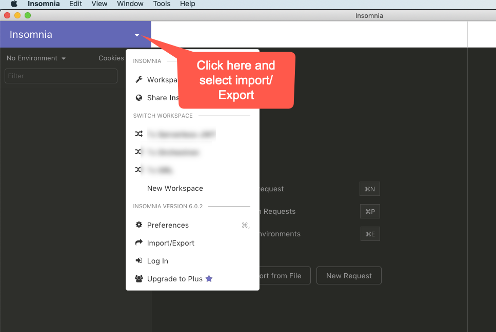
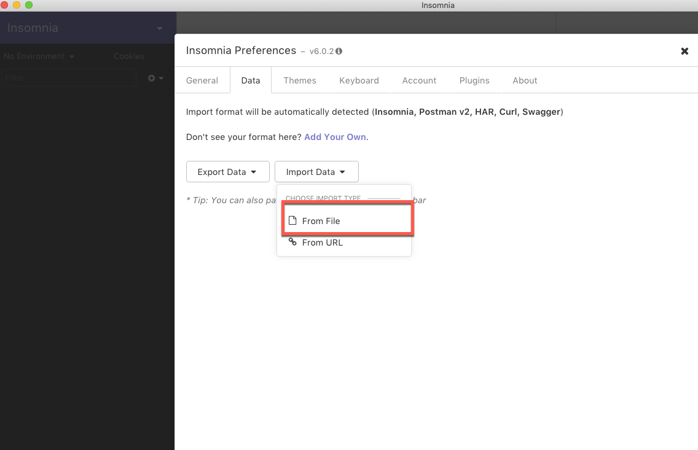
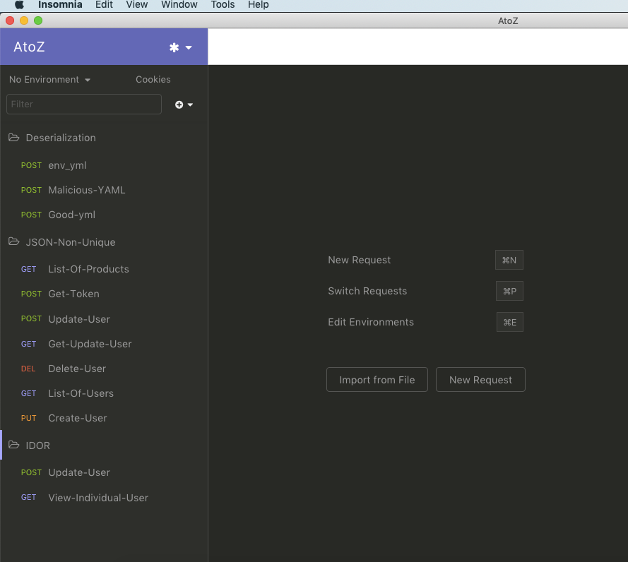

#DjangoconUS-2018
In this repository contains a vulnerable code. This examples made for only a **Security-Awarness** purpose. Same talk has been gave in DjangoConUs-2018 `Unique-Way-To-Hack-Into-A-Python-Web-Service`. Please don't use it in the Production Application


### Instruction
**Note :**  docker should be installed in your system else follow this link [https://docs.docker.com/install/linux/docker-ce/ubuntu/#os-requirements](Download Docker)

#### Step 1 : 
* Open Terminal and run `docker run -d -p 8000:8000 ti1akt/vul-djangorestframework:latest` docker command

```commandline
➜ djangoCon docker run -d -p 8000:8000 ti1akt/vul-djangorestframework:latest
01a4539ffe707ea7ec7807b8f441b8e5d7ea449269c357e1e870f0a76cb3e759
```


#### Step 2 :
**Note:** Insomnia Rest-client link to download ['https://insomnia.rest/](Download Insomnia Rest Client) 
* Import `rest_data.json` into *Insomnia* rest client

* 

* 

* 


**Note** Once it is done. Next follow the instruction in the `example` folder.
