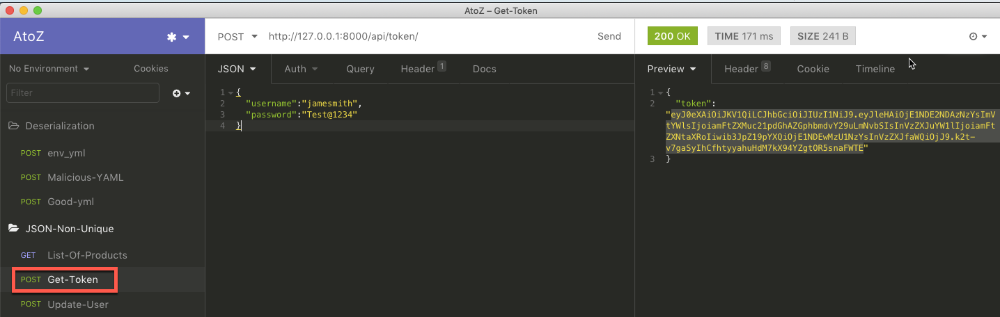
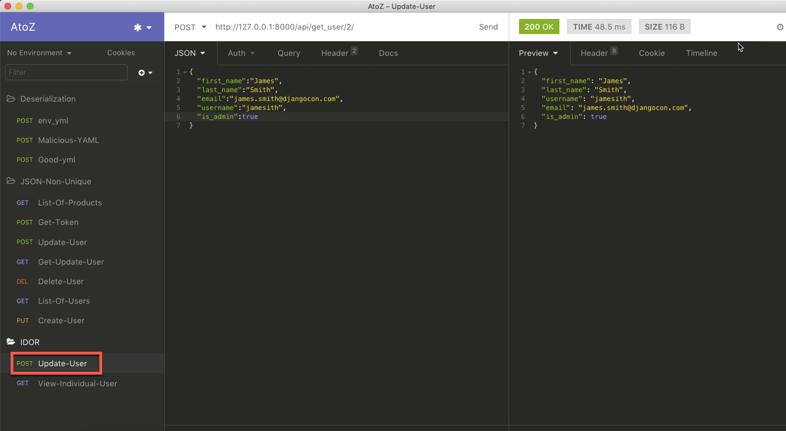
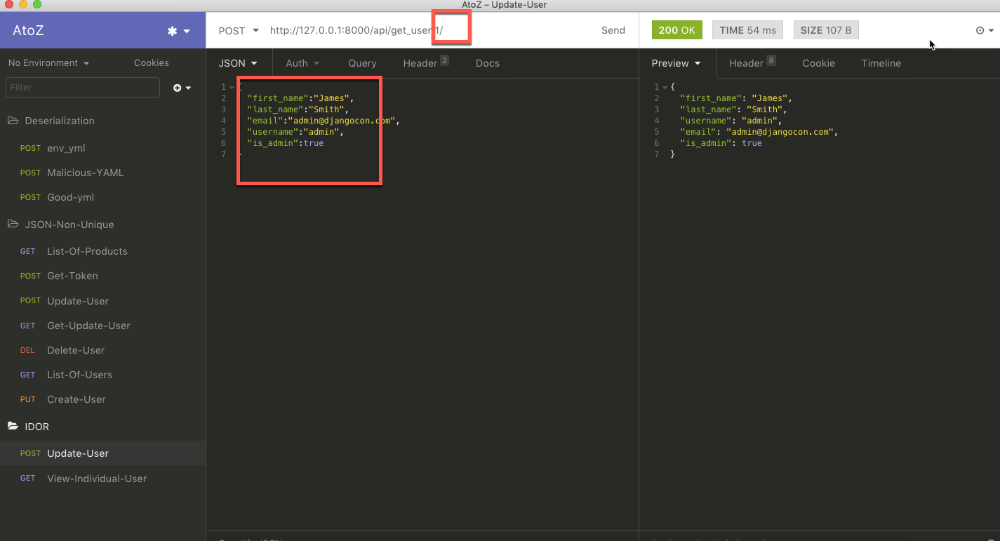

### List of users and Passwords

#####SuperUser
* username : superuser
* password : Test@1234
* Email    : superuser@djangocon.com

#####AdminUser
* username : jsmith
* password : Test@1234
* Email    : james.smith@djangocon.com


### Insecure Direct Object Reference

#### Step 1 : 
**Note:** If you did the `JWT Manipulation demo` the user `jamesmith` as username else use `jsmith` 
* Login as a `jsmith` user
* Once you logged in copy the `token` and paste it in the text editor

 

#### Step 2 :

**Note:** Copied token paste into `Authorization` field and give a space after `JWT`

* Update own profile info using his token



#### Step 3 :

* Instead of own profile update `superuser` info. In the URL instead of `id 2` change to `1` then update.

```json
{
	"first_name":"James",
	"last_name":"Smith",
	"email":"admin@djangocon.com",
	"username":"admin",
	"is_admin":true
}
```




 
