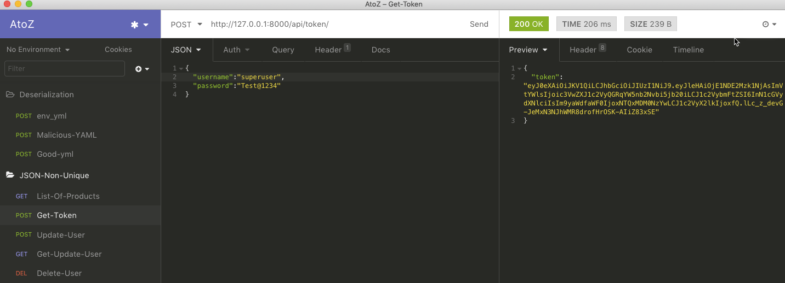
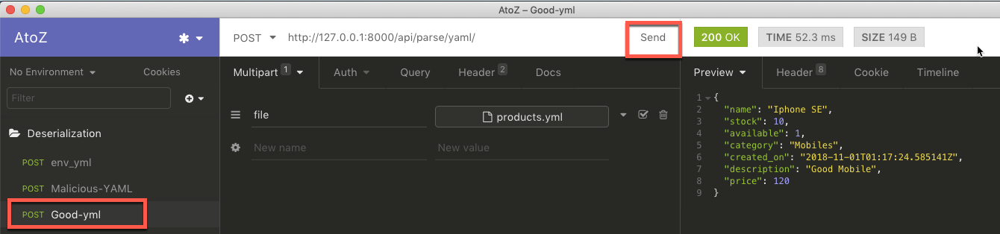
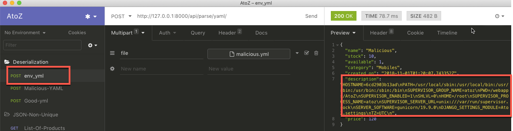

### List of users and Passwords

#####SuperUser
* username : superuser
* password : Test@1234
* Email    : superuser@djangocon.com

#####AdminUser
* username : jsmith
* password : Test@1234
* Email    : james.smith@djangocon.com

### Insecure Deserialization

#### Step 1 : 
* Login as a `superuser` user
* Once you logged in copy the `token` and paste it in the text editor

 

#### Step 2 : 

**Note:** Copied token paste into `Authorization` field and give a space after `JWT`

* Upload a `products.yml` file. it is inside the payload folder.

 
 #### Step 3 :
 
 **Note:** Copied token paste into `Authorization` field and give a space after `JWT`
 
 * Try to fetch   `environment varialbe` from the server. Upload a `malicious.yml` file. it is inside the payload folder.
 
 
 
 Once file uploaded will be able to see all the `environment variables` inside the server.
 

 
 
 
 
