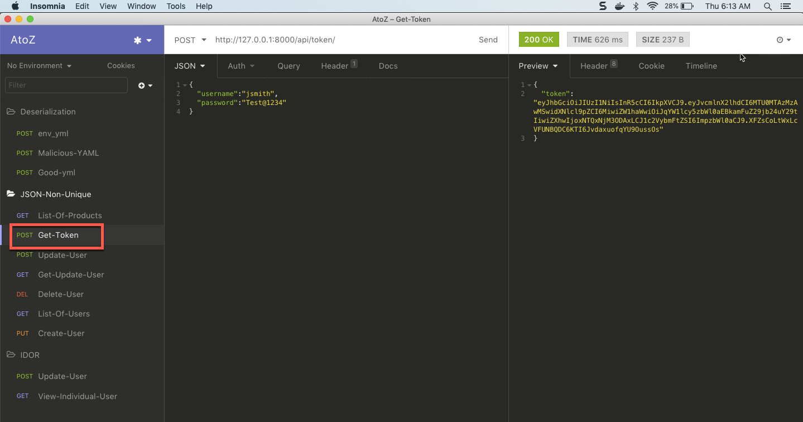
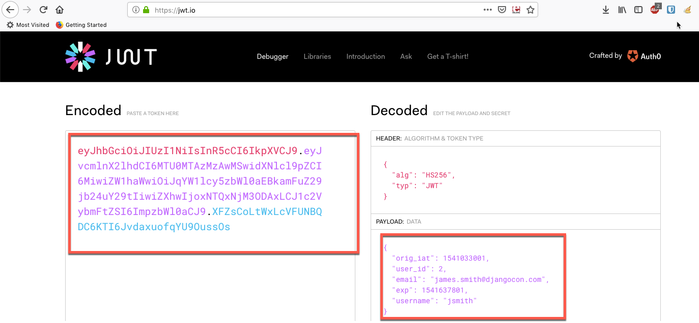
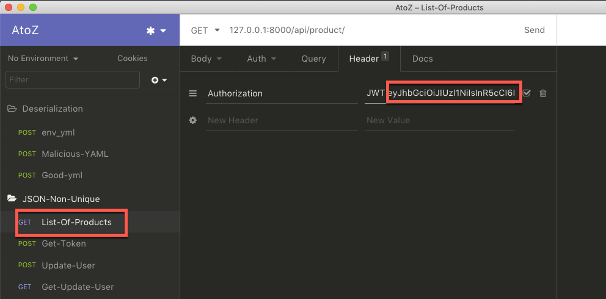
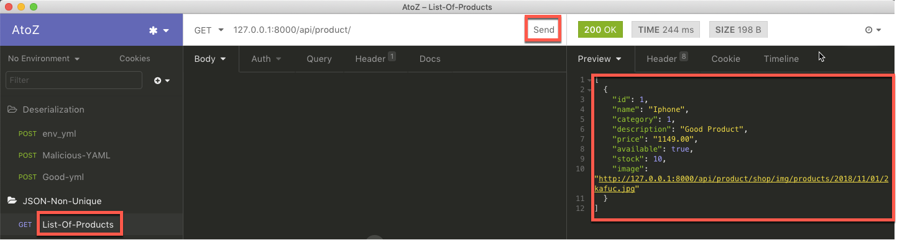
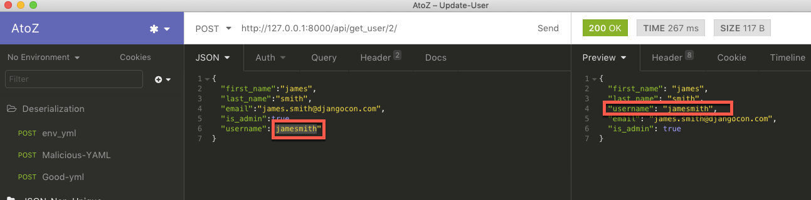
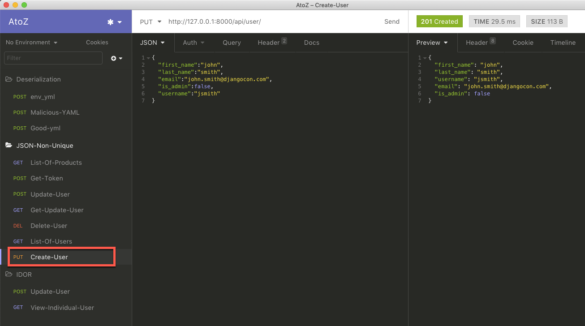

### List of users and Passwords

#####SuperUser
* username : superuser
* password : Test@1234
* Email    : superuser@djangocon.com

#####AdminUser
* username : jsmith
* password : Test@1234
* Email    : james.smith@djangocon.com


### JWT Manipulation


#### Step 1 : 
* Login as a `jsmith` user
* Once you logged in copy the `token` and paste it in the text editor

 

#### Step 2: 
* Open `https://jwt.io/`  in the Browser and paste the copied token inside of `encoded` field. then you will be albe to see the decoded token payloads



#### Step 3 :
* View the list of products
**Note:** Copied token paste into `Authorization` field and give a space after `JWT`




#### Step 4 :
* Once pasted the token then click `send` to view the list of products
 


#### Step 5 :

**Note:** Copied token paste into `Authorization` field and give a space after `JWT`
* Update User info , change `username` field instead of `jsmith` change to `jamesmith`.



#### Step 6 :

* Create a new user with `jsmith` username.
```json
{
	"first_name":"john",
	"last_name":"smith",
	"email":"john.smith@djangocon.com",
	"is_admin":false,
	"username":"jsmith"
}
```


#### Step 7 :

**Note:** If created user wants to see the products person should login into the application. But here will use copied token which is belongs to `james.smith@djangocon.com`.


Still it is showing the list of products

**Mitigation:** 

* Whenever user updated info renew the jwt-token
* Validate based on unique values like `email` not based on `username`


